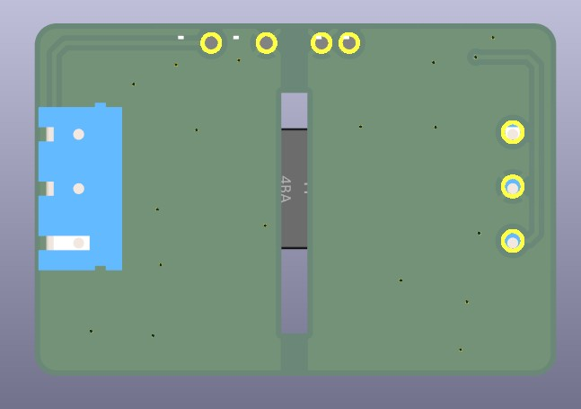

# Pinout PCB — Analog Signal Isolator

Dokumen ini adalah rujukan pemasangan untuk PCB yang ditunjukkan pada foto di bawah. Gunakan tulisan silkscreen pada PCB sebagai rujukan terakhir apabila orientasi foto atau terminal berbeda.

Untuk pemasangan pertama PCB bertuliskan `AIN/AOUT`, mulai dari [Mulai di Sini](START_HERE_ID.md). Dokumen ini adalah referensi pinout pelengkap.


## Konektor

| Sisi PCB | Label silkscreen | Fungsi | Sambungkan ke |
| --- | --- | --- | --- |
| **MCU SIDE** | `AOUT` | Keluaran analog terisolasi | Pin ADC / input analog pada mikrokontroler atau PLC |
| **MCU SIDE** | `GND` | Ground host | Ground mikrokontroler/PLC |
| **MCU SIDE** | `5V` | Catu masuk modul | +5 V DC yang teratur dan dibatasi arus |
| **SENSOR SIDE** | `AIN` | Masukan sinyal analog | Output sensor 0–5 V DC |
| **SENSOR SIDE** | `GND` | Ground sensor terisolasi | Ground sensor saja |
| **SENSOR SIDE** | `5V` | Catu keluar terisolasi untuk sensor | VCC sensor 5 V, maks. 150 mA kontinu |

> [!CAUTION]
> Jangan menghubungkan `GND` pada sisi MCU ke `GND` pada sisi SENSOR. Sambungan tersebut menghilangkan isolasi galvanik.

## Urutan sambungan yang aman

1. Matikan catu daya.
2. Hubungkan `5V`, `GND`, dan `AOUT` pada **MCU SIDE**.
3. Hubungkan `5V`, `GND`, dan `AIN` pada **SENSOR SIDE**.
4. Periksa kembali bahwa output sensor adalah 0–5 V DC terhadap ground sensor.
5. Pastikan tidak ada kabel atau perangkat lain yang menyatukan kedua ground.
6. Pastikan mode bawaan `M2.4V1` masih terpasang untuk ESP32, kemudian nyalakan catu +5 V host.

## Pemilih mode pada PCB ini


PCB pada foto menggunakan tiga footprint jumper solder/0 Ω bertuliskan `M2.4V1`, `M3.3V1`, dan `M5V1` dengan instruksi **FIT ONE ONLY**. Produk standar dikirim sebagai PCB rakitan dengan `M2.4V1` sudah terpasang untuk ESP32.

- Biarkan `M2.4V1` terpasang untuk ESP32.
- Bila konfigurasi diubah, pasang/jumper **satu saja** dari ketiga pilihan tersebut saat daya mati.
- `M3.3V1` ditujukan untuk kelas ADC 3,3 V.
- `M5V1` ditujukan untuk kelas ADC 5 V/PLC.
- Jangan menjumper dua atau tiga mode secara bersamaan.

Nama `M3.3V1` dan `M5V1` pada silkscreen menunjukkan kelas ADC, bukan jaminan tepat 3,3 V atau 5,0 V di `AOUT`. Paket teknis Rev B2 menargetkan 2,4 V / 3,0 V / 4,5 V secara nominal. Ukur dan kalibrasikan `AOUT` pada input 0 V dan 5 V sebelum digunakan untuk pengukuran presisi.

## Tampak bawah



Tampak bawah memperlihatkan pemisahan area sisi MCU dan sisi sensor serta celah isolasi. Jangan menambah kabel, jumper, sekrup, atau kontaminasi konduktif yang melintasi celah tersebut.

## Pemeriksaan sebelum operasi

- Sumber `5V` pada sisi MCU harus teratur dan memiliki pembatas arus; Rev B2 tidak memasang TVS dan PPTC di papan.
- Beban pada `5V` sisi sensor tidak boleh lebih dari **150 mA kontinu**. Rating DC/DC 200 mA mencakup konsumsi internal modul, sehingga bukan batas beban sensor eksternal.
- Tegangan sensor harus berada pada 0–5 V DC; tidak ada tegangan negatif.
- Untuk ESP32, mulai dari `M2.4V1` dan gunakan konfigurasi ADC yang tepat.
- Setelah pemasangan, cek `AOUT` pada `AIN = 0 V` dan `AIN = 5 V`, kemudian lakukan kalibrasi dua titik.

Rumus kalibrasi:

```text
VIN = (VMEAS − VZERO) × 5,0 / (VFULL − VZERO)
```
