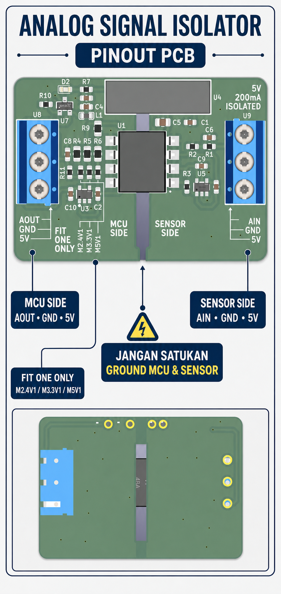
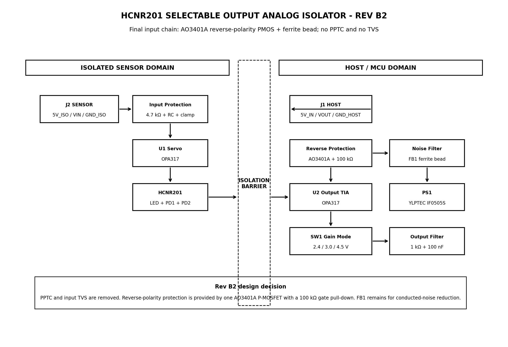
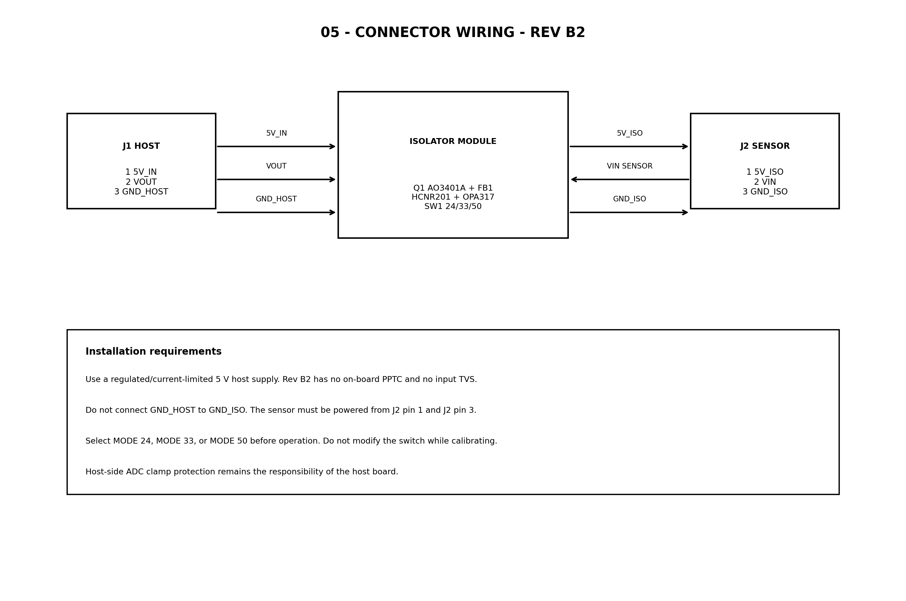
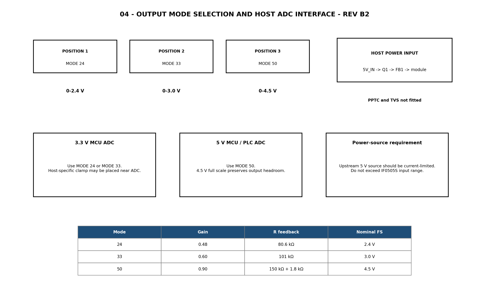
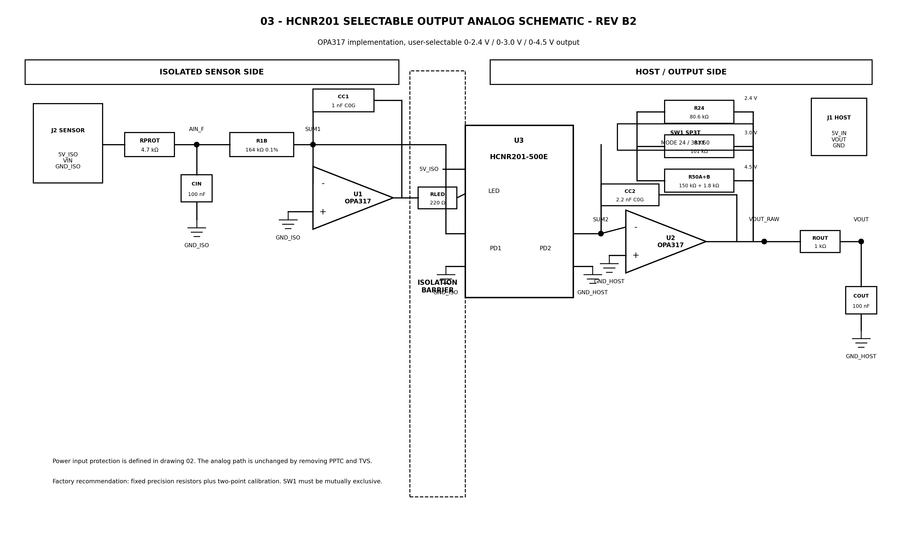
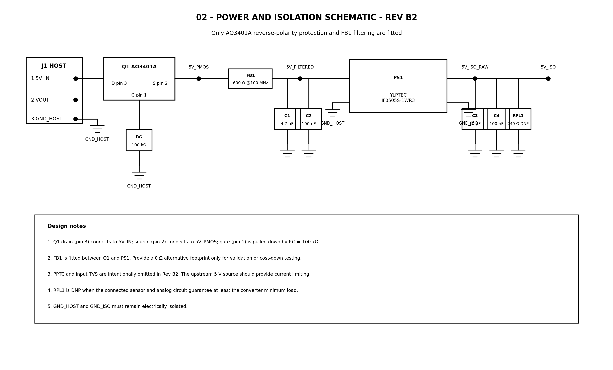

# Panduan Pengguna — Analog Signal Isolator

**Versi desain: Rev B2**
Modul ini mengirimkan tegangan analog DC dari sisi sensor ke sisi mikrokontroler/PLC **tanpa menyatukan ground kedua sisi**. Modul menerima sinyal sensor yang sudah dikondisikan pada rentang **0–5 V DC** dan menghasilkan tegangan keluaran yang dapat dipilih hingga **2,4 V, 3,0 V, atau 4,5 V**.

> [!NOTE]
> Panduan teknis Rev B2 menyebut selector `SW1`. PCB pada foto memakai jumper solder `M2.4V1` / `M3.3V1` / `M5V1`; ikuti [panduan pinout PCB fisik](PINOUT_PCB_ID.md) untuk pemasangan unit tersebut.

> [!IMPORTANT]
> Ini adalah modul isolator sinyal bertegangan rendah untuk sistem elektronik. Isolasi pada modul **bukan** pernyataan sertifikasi keselamatan, bukan pengganti proteksi petir/surge, dan tidak untuk langsung mengukur tegangan listrik PLN.





## Cocok untuk apa?

- Menghubungkan sensor analog 0–5 V ke ESP32, Arduino, MCU 3,3 V, ADC, atau PLC.
- Menghilangkan masalah *ground loop* dan gangguan antara sisi sensor dengan sisi kontrol.
- Memberi catu 5 V yang terisolasi kepada sensor melalui konektor sensor.

**Bukan untuk:** sinyal sensor mentah 4–20 mA, sensor dengan keluaran melebihi 5 V, sinyal AC, atau input yang ground-nya harus tersambung ke ground MCU. Gunakan rangkaian pengondisi sinyal yang sesuai terlebih dahulu.

## Spesifikasi ringkas

| Parameter | Nilai / keterangan |
| --- | --- |
| Input sinyal | 0–5,0 V DC dari sensor yang telah dikondisikan |
| Catu host | 5 V DC teratur (*regulated*), sebaiknya memiliki pembatas arus |
| Keluaran | 0–2,4 V / 0–3,0 V / 0–4,5 V nominal, dipilih dengan SW1 |
| Isolasi catu sensor | DC/DC 5 V ke 5 V terisolasi (IF0505S-1WR3) |
| Filter keluaran | 1 kΩ seri + 100 nF; tidak ditujukan untuk sinyal cepat |
| Rentang frekuensi praktis | Input mulai teredam sekitar 339 Hz; gunakan untuk sinyal DC/lambat |
| Proteksi polaritas catu | Ada, melalui MOSFET Q1 |
| Proteksi surge / sekering internal | **Tidak ada** pada Rev B2 (TVS dan PPTC tidak dipasang) |

## Kenali sisi konektor



| Konektor | Pin | Nama | Sambungkan ke |
| --- | ---: | --- | --- |
| **J1 — HOST** | 1 | `5V_IN` | Catu host +5 V |
|  | 2 | `VOUT` | Pin ADC / input analog host |
|  | 3 | `GND_HOST` | Ground host/MCU/PLC |
| **J2 — SENSOR** | 1 | `5V_ISO` | Catu +5 V untuk sensor (keluaran terisolasi modul) |
|  | 2 | `VIN` | Keluaran analog sensor 0–5 V |
|  | 3 | `GND_ISO` | Ground sensor |

> [!CAUTION]
> **Jangan pernah menyambungkan `GND_HOST` ke `GND_ISO`.** Kedua ground tersebut harus tetap terpisah agar fungsi isolasi bekerja. Jangan pula memberi catu 5 V eksternal ke `5V_ISO` kecuali Anda memang memahami arsitektur catu terisolasinya.

## Memilih mode keluaran

Pilih mode **saat daya mati**, sesuai batas tegangan ADC yang digunakan. Hanya satu mode yang boleh aktif.

| Mode | Keluaran pada input 5 V (nominal) | Rekomendasi pemakaian |
| --- | ---: | --- |
| **MODE 24** | 2,4 V | ESP32 atau ADC 3,3 V yang membutuhkan margin aman |
| **MODE 33** | 3,0 V | ADC MCU 3,3 V umum |
| **MODE 50** | 4,5 V | ADC 5 V, Arduino 5 V, atau input analog PLC |



Untuk ESP32, gunakan **MODE 24** sebagai pilihan awal. Pastikan juga konfigurasi attenuasi dan kalibrasi ADC ESP32 sesuai; ketelitian ADC internal dapat berbeda antar papan.

## Pemasangan cepat

1. Matikan seluruh catu daya dan pilih mode keluaran yang sesuai.
2. Pastikan sensor benar-benar memiliki output **0–5 V DC** dan tidak akan mengeluarkan tegangan negatif atau lebih dari 5 V.
3. Hubungkan J1: `5V_IN` ke +5 V host, `GND_HOST` ke ground host, dan `VOUT` ke ADC host.
4. Hubungkan J2: beri sensor daya dari `5V_ISO` dan `GND_ISO`, lalu hubungkan output sensor ke `VIN`.
5. Periksa kembali bahwa tidak ada kabel antara `GND_HOST` dan `GND_ISO`.
6. Nyalakan catu host 5 V yang teratur dan dibatasi arus. Untuk pengujian pertama, gunakan limit arus yang rendah namun cukup untuk sensor dan modul.
7. Berikan input sensor 0 V, lalu 5 V. Tegangan `VOUT` seharusnya mendekati 0 V dan nilai skala penuh mode yang dipilih.
8. Lakukan kalibrasi perangkat lunak sebelum memakai hasil pengukuran sebagai nilai presisi.

## Kalibrasi dua titik

Nilai keluaran nominal bisa sedikit berbeda akibat toleransi optocoupler, sensor, dan ADC. Kalibrasi dua titik menghilangkan sebagian besar kesalahan tersebut.

1. Terapkan `VIN = 0,000 V`; baca dan simpan sebagai `VZERO`.
2. Terapkan `VIN = 5,000 V`; baca dan simpan sebagai `VFULL`.
3. Untuk setiap pembacaan `VMEAS`, hitung tegangan input sensor:

```text
VIN = (VMEAS − VZERO) × 5,0 / (VFULL − VZERO)
```

Simpan pasangan kalibrasi untuk setiap unit dan setiap mode yang digunakan. Kalibrasi ini adalah kalibrasi **jalur isolator**; bila sensor perlu kalibrasi fisik (misalnya suhu atau tekanan), lakukan secara terpisah.

Contoh: jika MODE 24 menghasilkan `VZERO = 0,012 V`, `VFULL = 2,390 V`, dan ADC membaca `1,201 V`, maka `VIN` kira-kira `2,50 V`.

## Hal yang penting untuk keandalan

- Gunakan kabel catu 5 V yang pendek atau tambahkan proteksi surge/ESD pada level sistem bila kabel panjang/lingkungan bising.
- Rev B2 tidak memiliki TVS dan sekering resettable (PPTC) di papan. Sumber 5 V hulu harus memiliki pembatas arus yang memadai.
- Perlindungan clamp pada pin ADC merupakan tanggung jawab papan host. Jangan mengandalkan resistor 1 kΩ keluaran sebagai satu-satunya proteksi.
- Jangan mengubah pemilih mode saat proses kalibrasi atau ketika sistem sedang mengambil data penting.
- Jika sensor tidak stabil setelah dipasang, periksa kebutuhan beban minimum konverter DC/DC dan kualitas kabel/catu sensor.

## Pemeriksaan dan pemecahan masalah

| Gejala | Periksa terlebih dahulu |
| --- | --- |
| `VOUT` selalu 0 V | Catu +5 V di J1, orientasi/terminal J1, sensor mendapat 5 V di J2, dan `VIN` benar-benar memiliki tegangan terhadap `GND_ISO`. |
| Keluaran terlalu tinggi untuk ADC | Mode SW1 salah; pilih MODE 24/33 untuk ADC 3,3 V. Pastikan ADC dan clamp host tidak rusak. |
| Tidak ada isolasi / banyak noise | Pastikan `GND_HOST` tidak tersambung ke `GND_ISO` lewat kabel sensor, USB, osiloskop, atau perangkat lain. |
| Nilai skala penuh tidak tepat | Jalankan kalibrasi dua titik dan pastikan sumber uji 0 V/5 V akurat. |
| Modul tidak menyala atau catu turun | Periksa polaritas 5 V, kemampuan arus catu host, kabel pendek, serta beban yang terpasang pada `5V_ISO`. |
| Sensor bekerja tanpa beban tetapi tidak stabil saat terhubung | Periksa arus sensor dan kebutuhan beban minimum konverter; resistor preload RPL1 adalah opsi desain untuk kondisi tertentu. |

## Diagram teknis untuk teknisi

Diagram berikut berguna untuk penelusuran sinyal dan servis, tetapi tidak diperlukan untuk pemasangan normal.



Jalur catu host menggunakan MOSFET proteksi polaritas dan ferrite bead sebelum konverter DC/DC terisolasi.



## Isi paket desain

Folder `DOC/` memuat diagram blok, skematik catu dan analog, petunjuk pemilihan mode, pengkabelan, aturan layout PCB, prosedur pengujian, serta BOM. Folder `PCB/` memuat proyek KiCad, Gerber, drill file, footprint, dan model 3D untuk produksi.

Untuk bantuan teknis, sertakan foto pemasangan, mode yang dipilih, tegangan pada J1/J2, serta hasil pengukuran `VIN` dan `VOUT` saat menghubungi penjual/pembuat.
