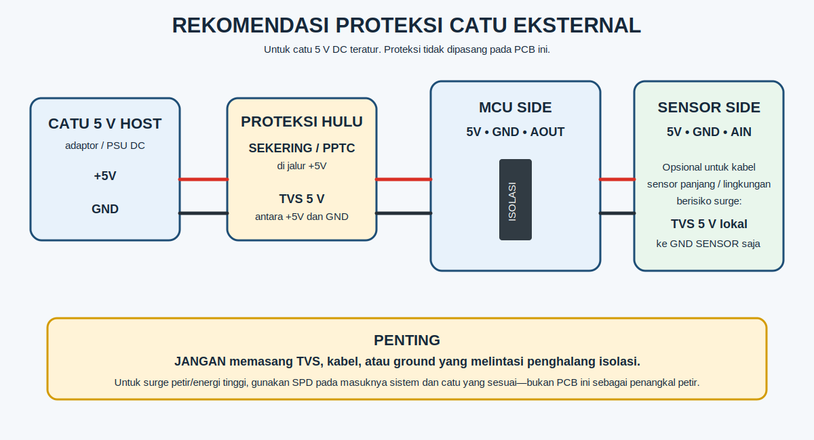
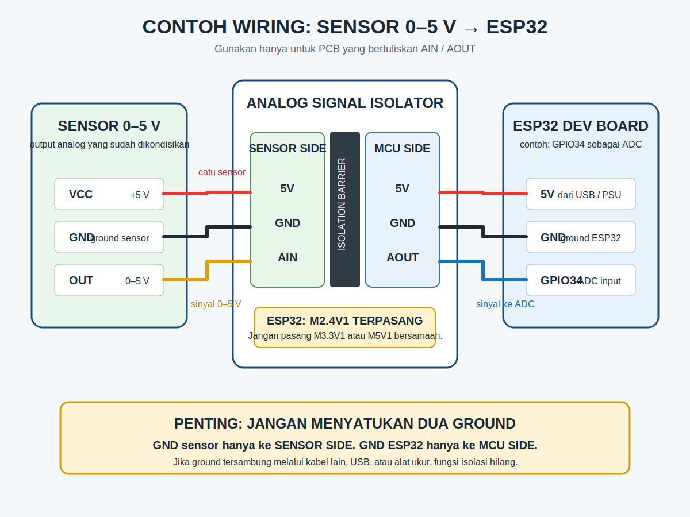

# Mulai di Sini — PCB bertuliskan `AIN` dan `AOUT`

Panduan ini adalah satu-satunya panduan pemasangan untuk PCB pada foto berikut. Ikuti nama pin yang tercetak pada PCB: **`AIN`**, **`AOUT`**, `5V`, dan `GND`.


> [!IMPORTANT]
> Jangan mengikuti istilah `J1`, `J2`, `VIN`, `VOUT`, atau `SW1` dari dokumen Rev B2 lama saat memasang PCB ini. PCB pada foto memakai `AIN/AOUT` dan pemilih mode berupa tiga footprint resistor 0 Ω.

Panduan ini cocok apabila silkscreen PCB Anda memuat semua tulisan berikut: `MCU SIDE`, `SENSOR SIDE`, `AOUT`, `AIN`, dan `FIT ONE ONLY`. Jika tidak, hentikan pemasangan dan minta panduan untuk revisi PCB yang Anda terima.

## Yang perlu disiapkan

1. Satu PCB Analog Signal Isolator yang sudah dirakit (isi paket produk).
2. Catu 5 V DC yang teratur dan memiliki pembatas arus.
3. Sensor dengan output **0–5 V DC** yang sudah dikondisikan.
4. Mikrokontroler/PLC dengan input ADC. Contoh berikut memakai ESP32.
5. Kabel penghubung yang sesuai. Sensor, kabel, catu daya, dan board ESP32 **tidak** termasuk paket.

> [!TIP]
> PCB produk ini sudah dirakit dan dikirim dengan mode ESP32 `M2.4V1` terpasang. Tidak perlu memasang resistor/jumper tambahan untuk penggunaan ESP32.

## Sebelum menghubungkan kabel

Mode bawaan produk sudah `M2.4V1` untuk ESP32. Area `FIT ONE ONLY` hanya dipakai bila konfigurasi perlu diubah saat daya mati oleh teknisi yang memahami perubahan tersebut.

| Perangkat host | Pasang 0 Ω pada | Keluaran pada AIN = 5 V (nominal) |
| --- | --- | ---: |
| ESP32 / ADC 3,3 V yang butuh margin aman | `M2.4V1` **(bawaan, sudah terpasang)** | sekitar 2,4 V |
| ADC kelas 3,3 V | `M3.3V1` | sekitar 3,0 V |
| Arduino 5 V / PLC | `M5V1` | sekitar 4,5 V |

**Jangan pasang dua atau tiga jumper.** Nama `M3.3V1` dan `M5V1` menunjukkan kelas ADC, bukan keluaran tepat 3,3 V atau 5,0 V.

## Batas arus catu sensor

Pin `5V` pada **SENSOR SIDE** boleh memberi daya sensor hingga **150 mA kontinu total**. Batas ini sudah menyisakan arus untuk rangkaian isolator, toleransi, suhu, dan lonjakan saat sensor mulai menyala.

> [!CAUTION]
> Konverter DC/DC pada PCB memiliki rating 5 V / 200 mA, tetapi angka itu adalah rating konverter secara keseluruhan—**bukan** arus yang seluruhnya tersedia untuk sensor. Jangan gunakan `5V` SENSOR SIDE untuk relay, motor, pemanas, atau beban dengan *inrush* besar. Pakai catu terisolasi eksternal untuk beban seperti itu.

## Proteksi catu eksternal (disarankan)



PCB ini tidak memiliki TVS maupun PPTC. Untuk pemasangan di panel atau mesin:

1. Beri catu hanya dari sumber **5 V DC teratur** pada MCU SIDE.
2. Pasang sekering atau PPTC pada kabel `+5V` sebelum PCB. Pilih rating dari arus sistem dan uji arus awal; 250–500 mA dapat dipakai sebagai titik awal desain, lalu disesuaikan hasil uji.
3. Pasang TVS **unidirectional, 5 V working voltage** di antara `+5V` dan `GND` sesudah sekering/PPTC. Pastikan energi surge dan tegangan jepit TVS sesuai dengan lingkungan/catu Anda.
4. Untuk kabel sensor panjang, TVS 5 V terpisah boleh dipasang dari `5V` ke `GND` pada sisi sensor. Jangan pernah memasang TVS atau kabel yang menghubungkan GND sensor dengan GND MCU.

> [!WARNING]
> Proteksi di atas untuk sistem 5 V DC. Untuk petir atau surge energi tinggi, gunakan SPD di pintu masuk panel dan catu yang sesuai. Jangan memakai PCB ini sebagai proteksi petir atau klaim sertifikasi keselamatan.

## Wiring contoh: sensor 0–5 V ke ESP32



| Dari | Ke | Fungsi |
| --- | --- | --- |
| Sensor `VCC` | **SENSOR SIDE** `5V` | Catu sensor 5 V terisolasi |
| Sensor `GND` | **SENSOR SIDE** `GND` | Ground sensor |
| Sensor `OUT` (0–5 V) | **SENSOR SIDE** `AIN` | Sinyal yang akan diisolasi |
| ESP32 `5V` / +5 V catu host | **MCU SIDE** `5V` | Catu masuk modul |
| ESP32 `GND` | **MCU SIDE** `GND` | Ground host |
| Pin ADC ESP32, misalnya GPIO34 | **MCU SIDE** `AOUT` | Sinyal analog terisolasi |

> [!CAUTION]
> `GND` sensor **tidak boleh** disambungkan ke `GND` ESP32. Periksa juga USB, osiloskop, dan perangkat lain karena dapat menyatukan ground secara tidak sengaja.

## Uji pertama dalam 5 menit

1. Matikan catu daya, lalu pastikan jumper bawaan `M2.4V1` masih terpasang untuk ESP32.
2. Hubungkan kabel sesuai tabel di atas.
3. Nyalakan catu +5 V pada **MCU SIDE**.
4. Ukur `AOUT` terhadap `GND` di **MCU SIDE**:

| Kondisi | Hasil yang diharapkan pada mode `M2.4V1` |
| --- | --- |
| `AIN = 0 V` | mendekati 0 V |
| `AIN = 5 V` | sekitar 2,4 V |

5. Jika hasil benar, baca `AOUT` melalui ADC dan lakukan kalibrasi dua titik.

```text
tegangan_sensor = (tegangan_ADC − VZERO) × 5,0 / (VFULL − VZERO)
```

## Contoh kode ESP32 (Arduino)

Contoh ini membaca `AOUT` pada GPIO34 dan mengubahnya kembali menjadi tegangan sensor. Ganti `VZERO` dan `VFULL` dengan hasil pengukuran unit Anda saat `AIN` diberi 0 V dan 5 V.

```cpp
constexpr int PIN_AOUT = 34;       // pilih pin ESP32 yang mendukung ADC
constexpr float VZERO = 0.012f;    // contoh hasil kalibrasi saat AIN = 0 V
constexpr float VFULL = 2.390f;    // contoh hasil kalibrasi saat AIN = 5 V

void setup() {
  Serial.begin(115200);
  analogReadResolution(12);
}

void loop() {
  const float vAout = analogReadMilliVolts(PIN_AOUT) / 1000.0f;
  float vSensor = (vAout - VZERO) * 5.0f / (VFULL - VZERO);
  vSensor = constrain(vSensor, 0.0f, 5.0f);

  Serial.printf("AOUT: %.3f V | Sensor: %.3f V\n", vAout, vSensor);
  delay(500);
}
```

GPIO34 hanya contoh; gunakan pin ADC yang tersedia di papan ESP32 Anda. Jangan menganggap angka kalibrasi contoh di atas sebagai angka bawaan modul.

## Jika tidak bekerja

| Gejala | Periksa |
| --- | --- |
| `AOUT` 0 V terus | Ada +5 V pada MCU SIDE; sensor mendapat +5 V pada SENSOR SIDE; sensor OUT benar-benar 0–5 V terhadap GND sensor. |
| ADC ESP32 selalu maksimum | Pastikan hanya `M2.4V1` yang terpasang dan `AOUT` masuk ke pin ADC, bukan pin digital biasa. |
| Pembacaan bising / isolasi tidak terasa | Cari ground yang tersambung lewat USB, osiloskop, shield kabel, atau catu eksternal. |
| Tidak tahu mode yang terpasang | Produk standar dikirim dengan `M2.4V1`. Bila tampak berbeda, lihat area `FIT ONE ONLY` atau tanyakan kepada penjual sebelum memberi daya. |

## Lanjutkan ke dokumen lain

- [Pinout visual PCB](pinout-pcb.html)
- [Infografik pinout siap dibagikan](assets/pinout-pcb-infographic.png)
- [Referensi teknis Rev B2](README.md) — untuk teknisi; istilah konektor dapat berbeda dengan PCB ini.
