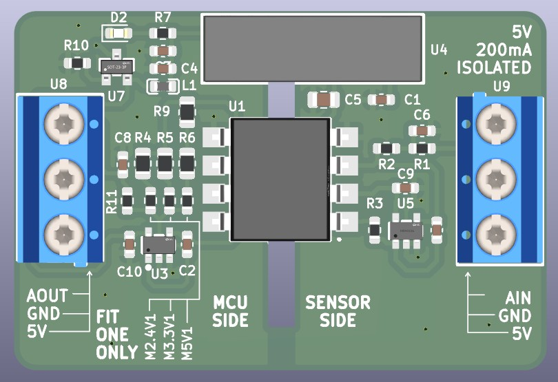

# Analog Signal Isolator

> Isolator sinyal analog 0–5 V untuk menghubungkan sensor ke ESP32, Arduino, MCU, atau PLC tanpa menyatukan ground kedua sisi.

> [!NOTE]
> Panduan pembeli pada halaman ini berlaku untuk PCB yang silkscreen-nya bertuliskan **`AIN`**, **`AOUT`**, `MCU SIDE`, `SENSOR SIDE`, dan `FIT ONE ONLY`.

<p align="center">
  
</p>

<p align="center">
  <a href="DOC/USER_GUIDE/start-here.html"><strong>Mulai pemasangan PCB AIN/AOUT &rarr;</strong></a>
  &nbsp;·&nbsp;
  <a href="DOC/USER_GUIDE/assets/pinout-pcb-infographic.png"><strong>Unduh gambar pinout &rarr;</strong></a>
</p>

## Produk ini untuk apa?

Analog Signal Isolator adalah **jembatan aman untuk sinyal analog 0–5 V**. Modul ini menerima tegangan dari sensor di satu sisi, lalu mengirimkan kembali nilai yang sama secara analog ke ADC mikrokontroler/PLC di sisi lain—tanpa hubungan listrik langsung antara kedua ground.

Masalah yang diselesaikan modul ini adalah *ground loop*, noise, dan gangguan ketika sensor berada di mesin/panel yang berbeda dengan ESP32, Arduino, PLC, data logger, atau komputer yang terhubung USB. Sensor tetap memperoleh catu 5 V dari sisi terisolasi, sedangkan MCU membaca sinyal melalui `AOUT`.

```text
Sensor 0–5 V       Isolator analog optik              Mikrokontroler / PLC

AIN ─────────────▶ [ SENSOR SIDE  ║  MCU SIDE ] ─────────────▶ AOUT → ADC
GND sensor         ground terpisah / tidak tersambung          GND MCU
```

**Intinya:** jika sensor menunjukkan 2,50 V pada `AIN`, modul meneruskan nilai proporsional pada `AOUT` sesuai mode yang dipilih. Perangkat lunak kemudian mengubah pembacaan ADC tersebut kembali menjadi nilai sensor melalui kalibrasi dua titik.

## Contoh aplikasi

| Aplikasi | Cara modul digunakan | Manfaat |
| --- | --- | --- |
| **Data logger ESP32** | Sensor tekanan, level, atau posisi 0–5 V dipasang di sisi sensor; `AOUT` dibaca ESP32 pada sisi MCU. | Mengurangi noise dan risiko gangguan ground saat ESP32 memakai USB/Wi-Fi. |
| **Monitoring panel mesin** | Sensor analog pada panel mesin dihubungkan ke `AIN`; sistem monitoring terpisah membaca `AOUT`. | Ground sistem monitoring tidak perlu disatukan dengan ground panel. |
| **Input analog PLC** | Sinyal sensor 0–5 V diteruskan ke input analog PLC melalui sisi MCU. | Membantu pemisahan domain sensor dan kontrol. |
| **Gateway IoT retrofit** | Tambahkan ESP32/Arduino untuk membaca keluaran sensor pada alat lama tanpa mengubah wiring sensor utama. | Integrasi monitoring jarak jauh lebih aman dan rapi. |

> Modul ini bekerja untuk **tegangan analog DC 0–5 V yang sudah dikondisikan**. Untuk sensor 4–20 mA, RTD, thermocouple, AC, atau tegangan PLN, gunakan rangkaian pengondisi sinyal yang tepat terlebih dahulu.

## Kenapa menggunakan modul ini?

- **Isolasi galvanik** antara sisi sensor dan sisi MCU/PLC untuk membantu mengurangi *ground loop* dan gangguan.
- **Input sensor 0–5 V DC** dengan keluaran analog terisolasi `AOUT`.
- **Catu sensor 5 V terisolasi** tersedia langsung pada konektor sisi sensor.
- **Mode untuk kelas ADC 2,4 V / 3,3 V / 5 V** melalui satu jumper pilihan (`FIT ONE ONLY`).
- **Siap untuk dokumentasi dan produksi:** proyek KiCad, Gerber, BOM, skematik, serta prosedur pengujian tersedia di repositori.

## Gambaran koneksi

| MCU SIDE | SENSOR SIDE |
| --- | --- |
| `5V` — catu masuk modul | `5V` — catu keluar terisolasi untuk sensor |
| `GND` — ground MCU/PLC | `GND` — ground sensor terisolasi |
| `AOUT` — ke input ADC | `AIN` — dari output sensor 0–5 V |

> [!CAUTION]
> **Jangan hubungkan ground MCU ke ground sensor.** Kedua sisi harus tetap terpisah agar isolasi bekerja.

## Mulai cepat

1. Buka [Mulai di Sini — PCB AIN/AOUT](DOC/USER_GUIDE/start-here.html).
2. Saat daya mati, pilih **satu** jumper mode: `M2.4V1`, `M3.3V1`, atau `M5V1`.
3. Hubungkan sensor 0–5 V ke `AIN` dan `GND` pada **SENSOR SIDE**.
4. Hubungkan ADC ke `AOUT`, catu +5 V ke `5V`, dan ground host ke `GND` pada **MCU SIDE**.
5. Nyalakan catu 5 V yang teratur dan memiliki pembatas arus, kemudian kalibrasikan pembacaan 0 V dan 5 V.

## Dokumentasi

| Dokumen | Kegunaan |
| --- | --- |
| [Mulai di Sini — PCB AIN/AOUT](DOC/USER_GUIDE/start-here.html) | Panduan utama pembeli: jumper, wiring ESP32, uji pertama, dan troubleshooting. |
| [Pinout visual](DOC/USER_GUIDE/pinout-pcb.html) | Cara pemasangan dari foto PCB atas/bawah; buka di browser. |
| [Gambar pinout siap dibagikan](DOC/USER_GUIDE/assets/pinout-pcb-infographic.png) | Infografik untuk pembeli, marketplace, atau teknisi lapangan. |
| [Panduan pengguna](DOC/USER_GUIDE/panduan-visual.html) | Penjelasan kerja, mode, wiring, kalibrasi, dan troubleshooting. |
| [Indeks dokumen teknis](DOC/README.md) | Skematik, BOM, aturan PCB, dan prosedur pengujian. |

## Struktur proyek

| Folder | Isi |
| --- | --- |
| `DOC/USER_GUIDE/` | Panduan pembeli, pinout, gambar produk, dan aset visual. |
| `DOC/` | Skematik, BOM, pengujian, serta referensi teknis Rev B2. |
| `PCB/AnalogIsolator/AnalogIsolator/` | Proyek KiCad, library lokal, Gerber, dan drill file produksi. |

> Rev B2 tidak memasang TVS dan sekering resettable (PPTC) pada papan. Untuk pemasangan yang andal, gunakan catu host 5 V yang teratur, dibatasi arus, dan perlindungan surge pada level sistem bila diperlukan.
